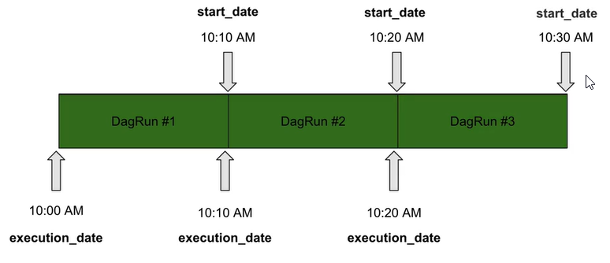

# The basics

## Define your DAG: the right way
- scheduler will read the files from the dag folder if they contain the words `dag` or `airflow`
    - change this with core.DAG_DISCOVERY_SAFE_MODE=False - will try to parse all
- can add `.airflowignore` to define files to be skipped
```python
from airflow import DAG
from datetime import datetime, timedelta

with DAG(dag_id='101my_dag',
         description='',
         start_date=datetime(2021,1,1),
         schedule_interval='@daily',
         dagrun_timeout=timedelta(minutes=10),
         tags=['data_science', 'customer'],
         catchup=False
         ) as dag:
         None
```
- if you have the same dag with the same id - will not report error, will get randomly one of the dags
- tasks will give an error if no start_date is not specified
- each task can have a different start_date (don't know why)
- schedule_interval ex: @daily, cron '1 * * * * ', timedelta(minutes=5)
- dagrun_timeout - recomanded so dagruns won't overlap
- tags - for different teams, 
- catchup - to disable untriggered dags from the past or while the dag is paused
    - setup in config scheduler.catchup_by_default=False
    - will still have one running dag when enabling the dag

## DAG Scheduling 101
### Important parameters
- start_date - Date at which tasks start being scheduled
- schedule_interval - interval of time from the min(start_date) as which the DAG is triggered
- "The DAG [X] starts being scheduled from the start_date and will be triggered **after** every schedule_interval"

Ex:
Assuming a start date at 10:00 AM and schedule interval every 10 minute

dag is actually ran after the scheduled interval(start_date), but the `execution_date` has the time before

## Cron vs Timedelta
- Cron expresion is stateless - absolute
- Timedelta is statefull - related to the last execution (start_date)
    - usefull for jobs that have exacly X days between them

schedule_interval = "@daily" -> 0 0 * * *
1. 01/01 00:00
2. 01/02 00:00
3. ...

start_date= 01/01 10:00 AM

schedule_interval=timedelta(days=1)
1. 01/01 10:00 AM - effectively triggered on 01/02 10:00 AM
2. 01/02 10:00 AM - effectively triggered on 01/03 10:00 AM

## Task idempotence and determinism
- Determinist - for the same input you get the same output
- Idempotent - if you execute multiple times the same dag you generate the same outcome

- keep in mind you can execute your task more than once
    - SQL - `CREATE TABLE IF NOT EXISTS ...`
    - bash - `mkdir -p my_folder`

## Backfilling

- if catchup=True - will trigger all dagruns from the start_date to the current date
- `airflow dags backfill -s 2020-01-01 -e 2021-01-01 dag_name`
- max_active_runs=1 - avoid to run more than 1 dag at a time
- in the interface cand rerun by clearing the selected dagruns
